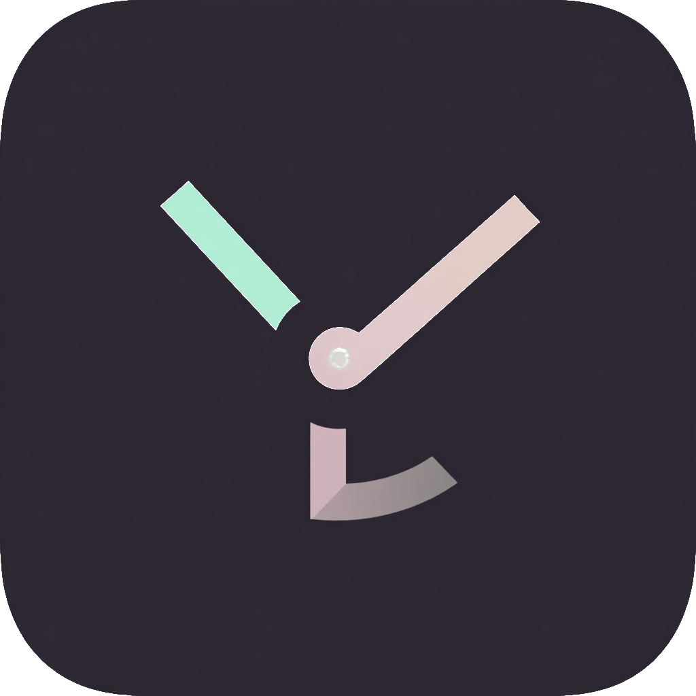
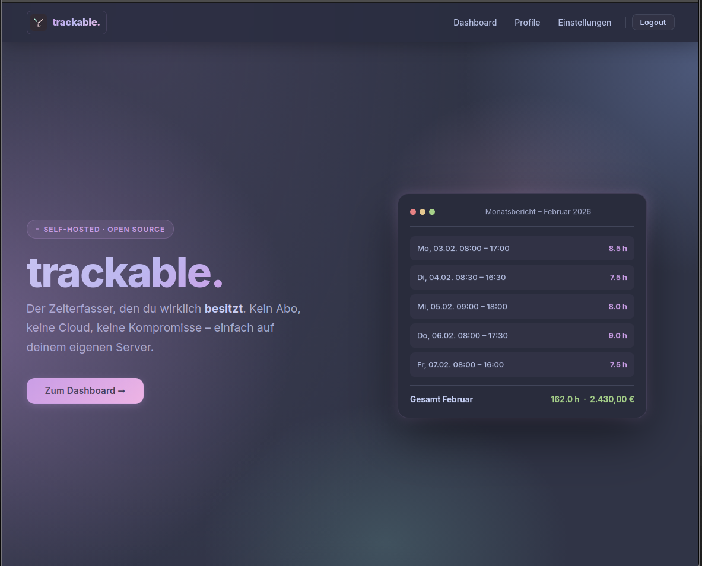
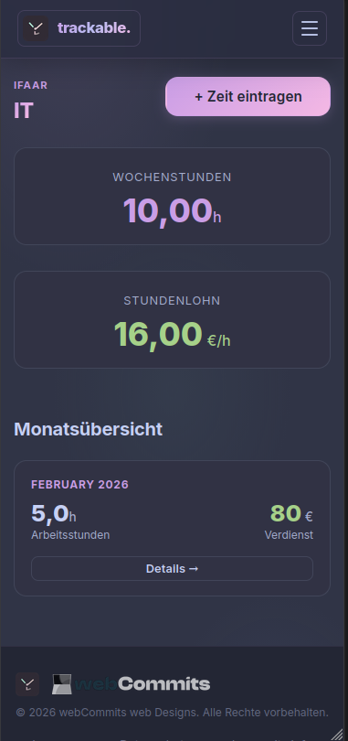

<div align="center">
  
  <h1>trackable.</h1>
  <p><strong>Simple, self-hosted time tracking &mdash; as a PWA.</strong></p>
  <p>
    
    
    
    
    
  </p>
</div>

---

## Screenshots

<div align="center">
  
  <br/><br/>
  
</div>

---

## Features

### Time tracking
- **📱 PWA** — Installable on iOS, Android, and desktop directly from the browser
- **⏰ Time tracking** — Quickly log start time, end time, breaks, and optional activity notes per day
- **⏱ Live Timer** — Start/Pause/Resume/Stop timer with one click; automatically creates time entries
- **🗂 Multiple profiles** — Separate tracking for different clients or jobs, with edit and delete support
- **📊 Monthly overview** — Automatic calculation of total hours and earnings per profile

### Exports
- **📄 PDF export** — Export monthly tables as landscape PDFs, fully translated (EN/DE)
- **📊 CSV export** — Export monthly time entries as semicolon-separated CSV, Excel-compatible (BOM)

### Business features
- **🏖 Vacation tracking** — Log vacation periods per profile; workdays are calculated automatically (Mon–Fri, excluding public holidays)
- **🎌 Public holiday management** — Configure public holidays via Django Admin; they are automatically excluded from vacation workday counts
- **🔒 Internal profile notes** — Attach private notes to each profile (e.g. contract details, department, payroll hints) — visible only to the account owner
- **📝 Time entry notes** — Add a short activity description to each time entry

### System
- **📧 Monthly email reports** — Automated summary email on the last day of each month
- **🔐 Authentication** — Login and password reset; accounts are created by a superuser via `/admin`
- **💾 Automatic backups** — Weekly SQLite database backups
- **🌍 English & German** — Auto-detects browser language; English by default, German when device locale is `de`
- **🎨 Catppuccin design** — Clean, mobile-first dark theme

---

## Tech Stack

| Layer | Technology |
|---|---|
| Backend | Django 5.0, Gunicorn |
| Frontend | Django Templates, CSS3, Vanilla JS |
| Database | SQLite (persistent Docker volume) |
| Static files | WhiteNoise (served directly via Gunicorn) |
| PDF | ReportLab |
| CSV | Python stdlib `csv` (semicolon-separated, Excel-compatible BOM) |
| Email | Django SMTP with html2text |
| Hosting | Docker, Docker Compose, Coolify |
| PWA | Web App Manifest |

---

## Self-Hosting with Docker

### Prerequisites

- [Docker](https://docs.docker.com/get-docker/) and Docker Compose
- A reverse proxy (Nginx, Caddy, Traefik) &mdash; **required in production**
- A domain name (for HTTPS)

### 1. Clone the repository

```bash
git clone https://github.com/yourname/trackable.git
cd trackable
```

### 2. Configure environment

```bash
cp .env.example .env
```

Edit `.env` and set at minimum:

```env
# Generate a secure key:
# python -c "from django.core.management.utils import get_random_secret_key; print(get_random_secret_key())"
SECRET_KEY=your-secret-key-here

DEBUG=False
ALLOWED_HOSTS=yourdomain.com

EMAIL_HOST=smtp.yourprovider.com
EMAIL_HOST_USER=you@yourdomain.com
EMAIL_HOST_PASSWORD=your-smtp-password
DEFAULT_FROM_EMAIL=noreply@yourdomain.com
```

### 3. Start the container

```bash
docker-compose -f docker-compose.prod.yaml up -d --build
```

On startup the container automatically runs `migrate`, `collectstatic`, and `compilemessages`.

### 4. Reverse proxy

A production-ready Nginx config is included at `nginx/trackable.conf` (TLS, HSTS, rate limiting, gzip).

For **Coolify**: set the compose file to `docker-compose.prod.yaml`, set the port to `8000`, and configure environment variables in the Coolify UI. Coolify's Traefik proxy handles SSL automatically.

> Static files are served directly by Gunicorn via WhiteNoise — no separate static file location in the reverse proxy needed.

### Standalone Docker Compose (without Coolify)

If you're running Docker Compose directly (without Coolify), the included Traefik labels handle routing and SSL:

1. Set `SUBDOMAIN` and `DOMAIN_NAME` in your `.env` file:
   ```env
   SUBDOMAIN=trackable
   DOMAIN_NAME=example.com
   ```
   This makes the app accessible at `trackable.example.com`.

2. Ensure Traefik is running on your server with Let's Encrypt configured

3. The compose file uses these environment variables to configure Traefik routing automatically

**Note:** If you're not using Traefik at all, remove or adjust the `labels` section in `docker-compose.prod.yaml` and configure your own reverse proxy (Nginx, Caddy, etc.).

### 5. Create the first user

There is no public registration. Create a superuser and manage all accounts via `/admin`:

```bash
docker exec -it trackable-app python manage.py createsuperuser
```

Then open `https://yourdomain.com/admin/` to:
- Create additional user accounts
- Add and manage **public holidays** (used to calculate accurate vacation workday counts)
- Review or edit any data directly

### Updating

```bash
git pull
docker-compose -f docker-compose.prod.yaml up -d --build
```

Migrations, static files, and translations are applied automatically on rebuild.

---

## Database Backups

### Manual Backup

Create an immediate backup of your SQLite database:

```bash
# Copy database from container to host
docker exec trackable-app cp /app/data/db.sqlite3 /tmp/db_backup_$(date +%Y%m%d_%H%M%S).sqlite3

# Download to your local machine (optional)
docker cp trackable-app:/app/data/db.sqlite3 ./db_backup_$(date +%Y%m%d).sqlite3
```

### Automated Backups with Cron

The built-in `backup_db` management command creates backups automatically. Configure the schedule via `.env`:

```env
BACKUP_SCHEDULE=weekly        # Options: daily, weekly
BACKUP_FILENAME=db_backup.sqlite3
```

#### Custom Cron Job (Advanced)

For more control, set up a cron job on your host system:

1. **Create backup script** `/opt/trackable/backup.sh`:

```bash
#!/bin/bash
BACKUP_DIR="/opt/trackable/backups"
DATE=$(date +%Y%m%d_%H%M%S)

mkdir -p $BACKUP_DIR
docker exec trackable-app cp /app/data/db.sqlite3 /tmp/backup_$DATE.sqlite3
docker cp trackable-app:/tmp/backup_$DATE.sqlite3 $BACKUP_DIR/
docker exec trackable-app rm /tmp/backup_$DATE.sqlite3

# Keep only last 10 backups
ls -t $BACKUP_DIR/*.sqlite3 | tail -n +11 | xargs -r rm
```

Make it executable:
```bash
chmod +x /opt/trackable/backup.sh
```

2. **Add cron job** (run `crontab -e`):

```cron
# Daily backup at 2:00 AM
0 2 * * * /opt/trackable/backup.sh

# Weekly backup (Sundays at 3:00 AM)
0 3 * * 0 /opt/trackable/backup.sh
```

3. **Verify backups**:

```bash
ls -la /opt/trackable/backups/
```

> 💡 **Tip**: Mount the backup directory as a Docker volume or sync to cloud storage (e.g., rclone, rsync) for off-site backups.

### Coolify

trackable. is fully compatible with [Coolify](https://coolify.io):

1. Add a new resource → Docker Compose
2. Point it at this repository
3. Set compose file to `docker-compose.prod.yaml`
4. Set port to `8000`
5. Add all environment variables from the table below
6. Deploy — Traefik handles SSL automatically

---

## Local Development

### With Docker (recommended)

```bash
make dev
```

App runs at `http://localhost:8000`. Useful Makefile commands:

| Command | Description |
|---|---|
| `make dev` | Start dev server with live reload |
| `make logs` | Follow container logs |
| `make shell` | Django shell inside container |
| `make migrate` | Run database migrations |
| `make test` | Run test suite |

### Without Docker

```bash
python -m venv .venv
source .venv/bin/activate
pip install -r requirements.txt

cp .env.example .env
# set DEBUG=True in .env

python manage.py migrate
python manage.py compilemessages
python manage.py runserver
```

---

## Environment Variables

| Variable | Default | Description |
|---|---|---|
| `SECRET_KEY` | &mdash; | Django secret key (required) |
| `DEBUG` | `False` | Set `True` for development only |
| `SUBDOMAIN` | `trackable` | Subdomain for Traefik routing (Standalone Docker Compose only) |
| `DOMAIN_NAME` | &mdash; | Base domain for Traefik routing (e.g., `example.com`). Ignored by Coolify |
| `ALLOWED_HOSTS` | &mdash; | Comma-separated list of allowed domains |
| `EMAIL_HOST` | `localhost` | SMTP host |
| `EMAIL_PORT` | `587` | SMTP port |
| `EMAIL_USE_TLS` | `True` | Use STARTTLS |
| `EMAIL_HOST_USER` | &mdash; | SMTP username |
| `EMAIL_HOST_PASSWORD` | &mdash; | SMTP password |
| `DEFAULT_FROM_EMAIL` | &mdash; | From address for outgoing mail |
| `BACKUP_SCHEDULE` | `weekly` | Backup frequency (`daily` / `weekly`) |
| `BACKUP_FILENAME` | `db_backup.sqlite3` | Backup file name |
| `MONTHLY_EMAIL_TIME` | `23:59` | Time to send monthly reports (HH:MM) |

---

## Internationalization

trackable. ships with **English** (default) and **German** translations.

Language is detected automatically from the `Accept-Language` header sent by the browser or device — no configuration needed. Set your OS or browser language to German and the interface switches automatically. PDF and CSV exports respect the active language as well.

---

## Business & Team Use

trackable. works well as a lightweight time-tracking solution for small businesses or freelancers with multiple clients.

### Public holidays

Configure country- or region-specific public holidays once via Django Admin (`/admin/core/holiday/`). They are automatically excluded from vacation workday calculations across all profiles — no manual adjustment needed.

### Profile internal notes

Each profile supports a private **Internal notes** field — visible only to the logged-in owner. Use it for contract details, department assignments, payroll notes, or any other context that should travel with the profile but not appear in exports.

### Exports at a glance

| Format | Location | Use case |
|---|---|---|
| PDF (landscape A4) | Monthly table → "Export PDF" | Filing, payroll submission |
| CSV (semicolon, BOM) | Monthly table → "Export CSV" | Excel, DATEV, further processing |

---

## License

[MIT](LICENSE) &copy; 2026 webCommits web Designs

---

<div align="center">
  <br/>
  <p>If trackable. saves you time, consider buying me a coffee ☕</p>
  <a href="https://paypal.me/dcmbrbeats">
    
  </a>
  <br/><br/>
  <a href="https://www.webcommits.info">
    
  </a>
  <br/>
  <sub>Built with ❤ by <a href="https://www.webcommits.info">webCommits</a></sub>
</div>
